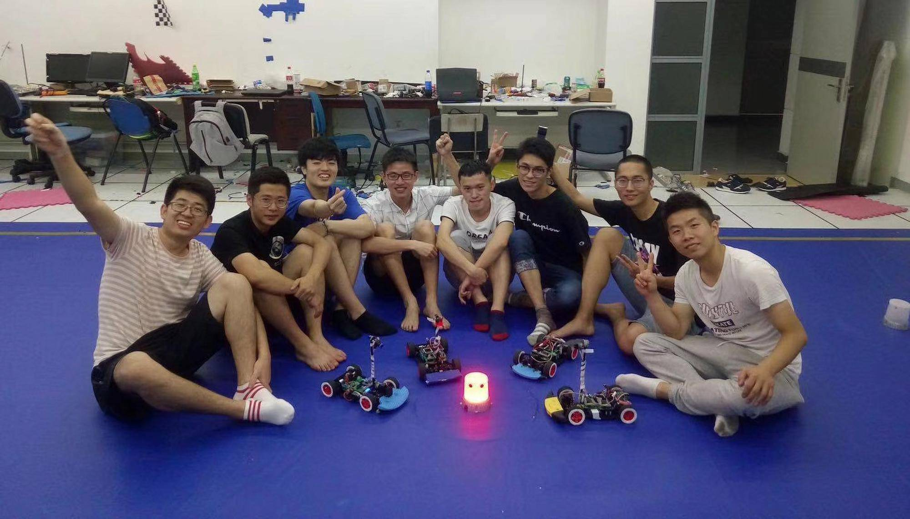
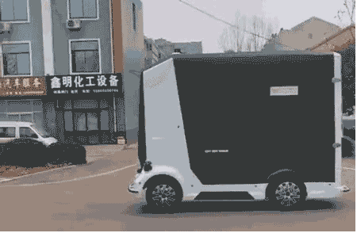

+++
# A Demo section created with the Blank widget.
# Any elements can be added in the body: https://sourcethemes.com/academic/docs/writing-markdown-latex/
# Add more sections by duplicating this file and customizing to your requirements.

widget = "blank"  # See https://sourcethemes.com/academic/docs/page-builder/
headless = true  # This file represents a page section.
active = true # Activate this widget? true/false
weight = 20  # Order that this section will appear.

title = ""
subtitle = ""

[design]
  # Choose how many columns the section has. Valid values: 1 or 2.
  columns = "1"

[design.background]
  # Apply a background color, gradient, or image.
  #   Uncomment (by removing `#`) an option to apply it.
  #   Choose a light or dark text color by setting `text_color_light`.
  #   Any HTML color name or Hex value is valid.

  # Background color.
  # color = "navy"
  
  # Background gradient.
  # gradient_start = "DeepSkyBlue"
  # gradient_end = "SkyBlue"
  
  # Background image.
  image = ""  # Name of image in `static/img/`.
  image_darken = 0.6  # Darken the image? Range 0-1 where 0 is transparent and 1 is opaque.

  # Text color (true=light or false=dark).
  text_color_light = false

[design.spacing]
  # Customize the section spacing. Order is top, right, bottom, left.
  padding = ["20px", "0", "20px", "0"]

[advanced]
 # Custom CSS. 
 css_style = ""
 
 # CSS class.
 css_class = "mini"
+++

I remembered how proud I felt when I received a medal for winning first place in the [NXP Cup National College Student Intelligent Car Race](https://www.nxp.com/company/blog/nxp-cup-students-build-and-race-autonomous-model-cars:BL-STUDENTS-BUILD-RACE-AUTONOMOUS) with the [smart car](</project/race-car>) that I designed. Since then, I have been working harder than ever on my research on autonomous vehicles. In the foreseeable future, I envision affordable mobile robots that are capable of breaking the limit of space to make people more connected, and freeing people from tiresome driving to focus on human interactions with their loved ones. At an undergraduate level, I am confident of my experiences and achievements in this direction through systematic training and research at [Tongji University](https://en.tongji.edu.cn/), [Hong Kong University of Science and Technology](https://hkust.edu.hk/), and (University of Michigan, Ann Arbor)[https://umich.edu/]. However, the more I dived in, the more I realized that my current knowledge and experience might not be enough in supporting my overarching dream and the idea to pursue higher education in an institution sharing my vision is becoming more compelling by day. 

Having realized that theories and practice cannot exist without each other in engineering, on one hand, I invested heavily in theoretical study and complete 850 hours of Mathematics courses while finishing 3952 hours of courses in Electrical Engineering and Computer Science with an overall GPA of 89.4/100.  Thanks to the systematic and rigorous mathematics training at Tongji University, I have built a solid foundation in critical thinking and reasoning abilities. Professional courses such as Embedded Systems equipped me with excellent programming skills and knowledge of microcontrollers. By venturing out to high-level courses in [robotics](https://www.coursera.org/specializations/robotics) and [self-driving cars](https://www.coursera.org/specializations/self-driving-cars) online, I began to see the whole picture of robotics. 

Unsatisfied with theoretical knowledge alone, I aggressively sought out chances to apply theories into practice while further consolidating theoretical knowledge through practice, a synergistic cycle. When other students called it quit in the face of bottlenecks, I kept going and with each case, my skills and experiences grew. During the [National Electronic Design Competition](https://www.bilibili.com/video/BV1yb411B7VE), I successfully designed and created a wireless charging circuit with Altium, which enabled my smart car to run much longer than other competitors. In the research program at the department of information engineering, I designed a [novel street lamp system prototype](/project/street-light-model) with crowd-sourced control methods to resolve high energy consumption and pedestrian safety problems, during which I became competent in processing sensor data and programming microcontrollers and later published my findings at 2019 ICAICS. I took to heart that when applying a theory to practice, there are often many realistic issues to overcome and chances are that theoretical calculations are far away from the experimental results. From the original intimidation and disappointment to later feeling energized from overcoming challenges has pushed me to be extremely resilient and calm in the face of obstacles.

<iframe src="//player.bilibili.com/player.html?aid=45230659&bvid=BV1yb411B7VE&cid=79195367&page=1" scrolling="no" border="0" frameborder="no" framespacing="0" allowfullscreen="true"> </iframe>

Looking to conduct more independent research and extend my knowledge, I applied to the [Robotics and Artificial Intelligence Laboratory(RAIL)](https://rail.tongji.edu.cn/index.html) at Tongji University early in my sophomore year and was involved in the process of developing an intelligent beacon tracking race-car from start to finish, based on which I also extended my reading to more advanced control like fuzzy control and path-planning algorithms. I spent countless nights in the lab that year as I was entirely dedicated to testing controller performance under different paths to correct fuzzy decision parameters. Hard work always pays off, you can imagine how proud I felt when my smart car demonstrated superior performance in the competition and won the national first prize. Later, [my paper](/publication/2004-false-memories) on this product was successfully published at the DEStech Transactions on Computer Science and Engineering Journal. 

During the one-year project in RAIL, I noticed that the hardware of the smart car limits its application. The goal of “making real self-driving cars and robots” is exactly what I am pursuing. Transforming robotics from simulation to a real machine in a real-world setting poses immense challenges and uncertainties for researchers; I know this too well from my previous work but am still eager to jump into this grand, world-changing challenge, because only when my research on smart machines is implemented in a real robot, I could finally relax with pride that I have served in making our life easier rather than harder. Therefore, I began to think about how far smart cars were away from autonomous vehicles in the real world in [Tongji-MIT City Science Lab](https://www.media.mit.edu/projects/city-science-lab-shanghai/overview/) where I focused on the development of a Sim-to-Real platform for unmanned logistics systems. Unlike previous studies of microcontrollers, this time I was challenged to develop in the Linux and ROS operating environment and utilize the OpenCV library in processing real-time images captured by attached cameras. Although our product is still the low-speed mobile robots in the lab, it is similar to autonomous vehicles in its complete framework: the camera-based sensing module allows the car to "see" the surrounding environment, traffic sign and object recognition let the car know “how to drive”, decision-making rules kick in when the car is “thinking how to get there” and control makes the car operate according to our “instructions”. What’s more, we connected the developed simulator to real cars to enable fast development from simulation to real scenarios. Honestly, I couldn’t stop thinking about how cool my projects are and how amazing it is to be on the frontier of robotics and through this project, I was able to see autonomous vehicles from a paranormal perspective.

<iframe width="560" height="315" src="https://www.youtube.com/embed/Kvw9NMSZzRQ" frameborder="0" allow="accelerometer; autoplay; clipboard-write; encrypted-media; gyroscope; picture-in-picture" allowfullscreen></iframe>

In 2019 summer, Dr. Youling Yu recommended me to the [RAM-LAB](https://www.ram-lab.com/) of HKUST, where Hong Kong's first unmanned vehicle was developed, for the highly competitive research program on developing a simulator for the “Kuafu” self-driving car. With such a complex and demanding project on hand, I quickly got to work by researching extensive literature and codes, learning the unmanned vehicle prototype architecture inside and out, building Kuafu’s dynamics model and combining it with controllers through ROS. With my great efforts, a highly accurate simulator was born, even one month earlier than expected! Furthermore, when testing the sliding mode controller in the simulator, I noticed that the chattering phenomenon was significant and thus took up the challenge to train an adaptive dynamic programming(ADP) network to further improve the tracking accuracy in high-speed situations. The hectic summer months quickly flew by and even the smallest progress and improvement I made brought me indescribable joy and a sense of fulfillment; researching driverless cars never feels like work or chores to me, but utterly fascinating and satisfying. 

As my perceptions of unmanned vehicles deepen, I can see that current research on individual vehicles is gradually advancing; however, making autonomous driving a reality in a busy city still demands answers to problems, such as mutual intentions understanding between cars and pedestrians, human-robot interaction and so on. Therefore, I mainly focused on human-machine/robot interaction when doing research under Prof. Qi. With my strengths in data analysis and familiarity with tactile sensors, I was tasked to be responsible for the design of a novel robot fingertip attached with tactile sensors to explore detailed properties of touched surfaces. Considering the irregularity of normal objects, I further presented a robust surface following algorithm based on the tactile force for the fingertip to follow irregular objects. The [findings](/publication/2011-gender-attitudes/) on tactile interaction between robot and object have been submitted to ICRA 2021. In order to explore more interesting interactions between robots and humans, I am working at the [Lifelong Learning Lab](https://web.eecs.umich.edu/~xwanghci/) in [UMich](https://cse.engin.umich.edu/about/welcome-to-cse/) supervised by [Prof. Xu Wang](https://web.eecs.umich.edu/~xwanghci/), where I devoted myself to designing a chat robot to solve different user needs in cooperation meetings, i.e. time allocation and incomplete hearing problem. However, as I went further in this field, I realized that self-driving cars and robotics is such a kind of cutting-edge research area and there remains a huge number of research problems in the interaction between cars/robots and humans. 

Thank you so much for reading.