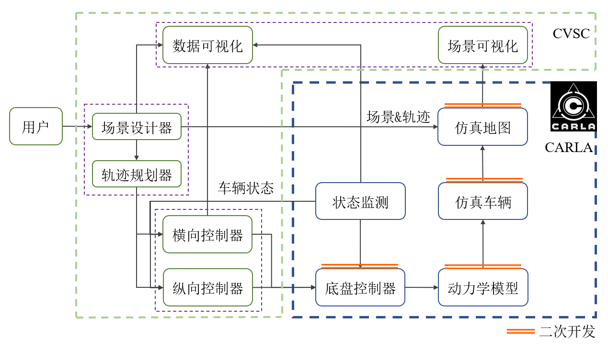
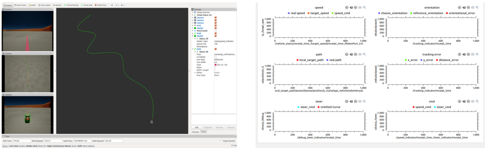
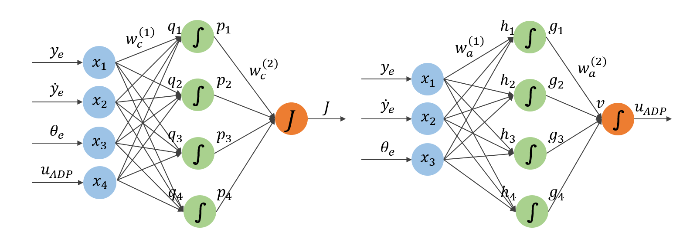
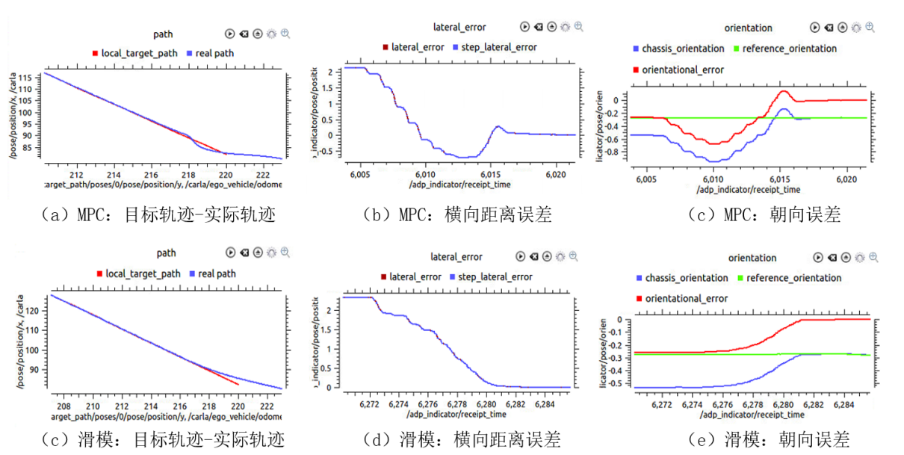

With the rapid development of artificial intelligence, self-driving cars have gradually become a research hotspot. However, the expensiveness of self-driving cars and the insecurity of field testing greatly limit the test of control algorithms. A convenient and reliable simulator is essential for researchers to develop control algorithms. This paper is aimed to develop a Close-loop Simulator for Vehicle Control (CSVC) based on the virtual environment of open-source Simulator Carla. A sliding mode control algorithm coupling lateral error and orientation error is then developed and an adaptive dynamic programming method is used to improve the tracking accuracy. Finally, the CSVC simulation platform is evaluated comprehensively, and the proposed control algorithm is verified in the CSVC simulator.

We added a new virtual simulation scene on the basis of the Carla module, calibrated the dynamic model of the vehicle, and improved a new low-level control algorithm. Excepted the CARLA module, a trajectory plan module with three kinds of interpolation curve fitting method is designed, which enables users to simulate different trajectories by visual operation. The visualization module including simulation animation and simulation data is developed. The Robot Operating System, ROS is used to connect the control module, plan module, visualization module and Carla module.

For trajectory tracking problem, the control module was designed and implemented on the basis of kinematics of self-driving cars. This paper systematically discussed the sliding mode control theory and its advantages, and proposed a new sliding mode control algorithm coupling lateral error and orientation error, which promises the convergence of both lateral error and orientation error to zero. This paper also attempts to use Adaptive Dynamic Programing(ADP) to improve the accuracy of control algorithm, and designed the corresponding critic network structure and action network structure.

Finally, this paper evaluated and verified the credibility of the simulation platform from three aspects, vehicle dynamic model, low-level controller, and trajectory planning module. The vehicle dynamics model is very reliable after the calibration and the performance of low-level controller is good and it can accurately track the desired speed command. The trajectory planning module can be very convenient to for users to generate three different trajectory curves. The proposed sliding mode control algorithm is verified to be better when compared with MPC control algorithm and adaptive dynamic programming learning algorithm is proved to be effective to improve performance of the control algorithm.

 

**Key words：**self-driving cars, sliding mode control, adaptive dynamic programming, dynamic model, ROS

