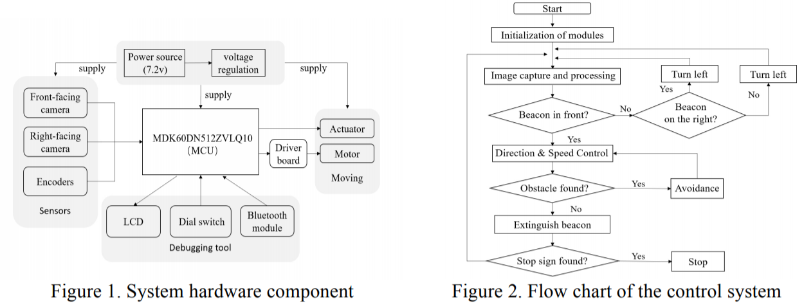
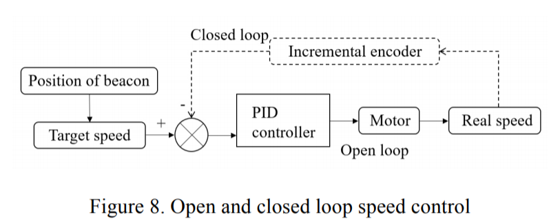
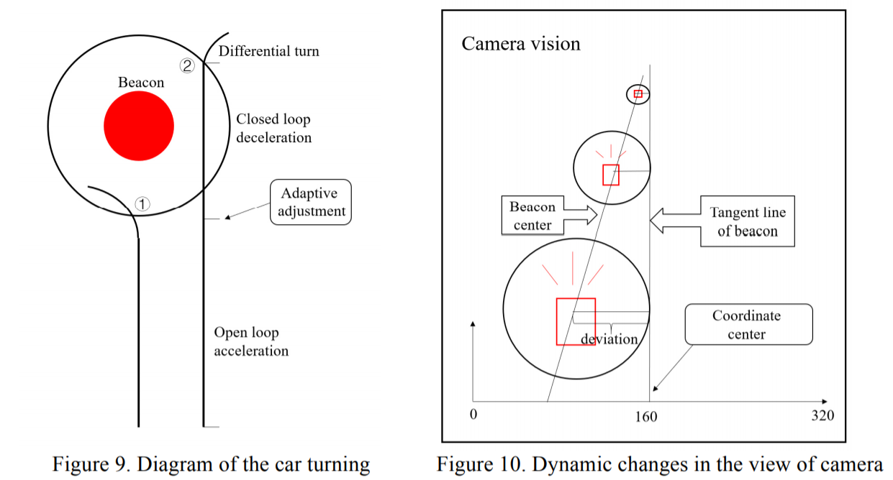

### Introduction

In recent years, automobile and technology companies have continuously innovated in-vehicle electronic technologies. The development trends are characterized by security, networking, and intelligence\[1]. Intelligent car, also known as wheeled mobile robot, is the integration of the environmental awareness, planning and decision-making, and automation-running\[2]. This paper designs a smart car based on MDK60DN512ZVLQ10 (K60) and OV7620 camera for directional movement of illuminating beacons. The system combines image recognition, speed control, straight line fitting algorithms and so on, which have practical significance for the smart car control.

### System structure 

The Microcontroller Unit(MCU) of the smart car system is two master-slave cooperated K60. The sensors are two OV7620 cameras and two incremental encoders. The front-facing camera is used to obtain the position of the illuminating beacon and the obstacle, and the right-facing camera is used to search for the illuminating beacon in the right area, assisting the car to judge the direction autonomously. The encoder is used to obtain the current speed and mileage. After receiving and processing the completed image, the master K60 combines the slave K60 information to obtain the target speed and the target angle. According to the current speed fed back by the encoders, the motor speed control and steering control are realized by pulse width modulation (PWM), in order to achieve the directional movement of the smart car to the luminous beacon. The system adopts LCD display, dial switch and Bluetooth module for debugging. The LCD display can output camera image and various position parameters. The dial switch is used to change the running mode of the car, and the Bluetooth module is used to remotely control the car. According to the design, the system structure diagram is shown in Fig.1,2.

### Speed control strategy

Speed control is especially critical for beacon smart car. When the car approaches or leaves the beacon, turns to find beacons, avoids obstacles, etc., it must go through the process of deceleration or acceleration, and the car needs to achieve both stability and rapidity. Open-loop and PID-closed-loop control are classic algorithms for speed control, as is shown in Fig.8. \[3] Digital PID is adopted in the microcontroller, that is, Eq.1. After testing, we get a set of applicable parameters:

In this smart car system, instead of simple PID control or fuzzy PID control\[3], it combines PID control, open loop control, inertia deceleration, differential turn and other strategies for flexible control: the acceleration process adopts full duty cycle open-loop control, the deceleration process, that is, when approaching the beacon, adopts PID control, but the deceleration interval size is adaptive, and the deceleration mode is started according to the current speed of the encoder feedback, so that the car arrives at the beacon at a speed of 3.5m/s, the turning process is controlled by the open loop of 1.6m/s. The speed control strategy is shown in Fig.9.

### Path Planning

The smart car is expected to decide the turning direction automatically after extinguishing the beacon. Therefore, the system adopts the second way(②) as shown in Fig.9. The car goes straight to the edge of the beacon, directly extinguishing the beacon when passing it, and then makes an autonomous decision according to the orientation of the next beacon.

### Conclusion

Taking the MDK60DN512ZVLQ10 microcontroller as control chip, the smart car system uses cameras to identify the beacon, and collects and analyzes the information to ensure that it can adaptively avoid obstacles when it is oriented to the beacon. After debugging and testing, the system has satisfying results. The smart car system can be used as the original model and reference for the innovation and development of automotive electronics technology, and has practical significance.